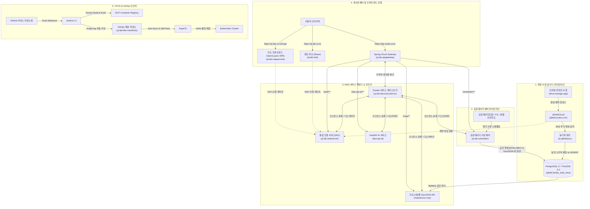

# 🧪 SJ-LAB: Kubernetes & MSA 기반 공간정보(GIS) 및 시설물 관리 통합 플랫폼

> **SJ-LAB**은 모바일 현장 시설물 점검부터 공간정보(GIS) 시각화, MSA 분산 백엔드, 통합 인증(SSO), Kubernetes GitOps 자동 배포까지 전 주기를 아우르는 엔드투엔드(End-to-End) 클라우드 네이티브 웹 플랫폼입니다.

---

## 1. 플랫폼 개요 및 엔드투엔드(End-to-End) 데이터 흐름

SJ-LAB은 재난·공공시설물을 **현장에서 모바일로 점검하고(Field), 사무실에서 웹으로 조치(Office)하는 전체 업무 라이프사이클**을 지원합니다. 11개의 독립적인 마이크로서비스와 인프라 모듈이 유기적으로 연동되어 대규모 공간 데이터 파이프라인을 형성합니다.


```mermaid
flowchart TD
    subgraph 현장_수집_파이프라인 ["1. 현장 수집 및 ETL 파이프라인"]
        FieldApp["모바일 현장조사 앱<br>(infra-manage-app)"] -->|"점검 결과 업로드"| QFieldCloud["QFieldCloud<br>(qfield.sj-lab.co.kr)"]
        QFieldCloud -->|"30초 주기 변경 감지"| Worker["동기화 워커<br>(sj-qfieldsync)"]
        Worker -->|"동적 스키마 확장 & UPSERT"| PostGIS[("PostgreSQL 17 / PostGIS 3.4<br>(qfield.facility_total_view)")]
    end

    subgraph 공공데이터_수집_배치 ["2. 공공데이터 배치 파이프라인"]
        PublicAPI["공공데이터포털 / ITS / 생활안전지도"] -->|"정기 크론 스케줄링"| Scheduler["공공데이터 수집 배치<br>(sj-lab-scheduler)"]
        Scheduler -->|"공간 투영(EPSG:3857) & GeoJSON 뷰 생성"| PostGIS
    end

    subgraph MSA_백엔드_인프라 ["3. MSA 서비스 백엔드 & 인프라"]
        PostGIS -->|"MyBatis 공간 쿼리"| MapAPI["지도/시설물 GeoJSON API<br>(mapservice-rest)"]
        Eureka["Eureka 서비스 레지스트리<br>(sj-lab-discoveryServer)"] <--->|"인스턴스 등록 / 디스커버리"| MapAPI
        Eureka <--->|"인스턴스 등록 / 디스커버리"| Scheduler
        Eureka <--->|"인스턴스 등록 / 디스커버리"| AuthServer["통합 인증 서버 (SSO)<br>(sj-lab-authserver)"]
        Eureka <--->|"인스턴스 등록 / 디스커버리"| FastAPIAI["FastAPI AI 서비스<br>(fast-api-ai)"]
        QFieldCloud -.->|"계정 위임 검증"| AuthServer
    end

    subgraph 트래픽_및_프론트엔드 ["4. 게이트웨이 및 프론트엔드 포털"]
        Gateway["Spring Cloud Gateway<br>(sj-lab-apigateway)"] <--->|"라우팅 테이블 질의"| Eureka
        Gateway -->|"/map/**"| MapAPI
        Gateway -->|"/auth/**"| AuthServer
        Gateway -->|"/scheduler/**"| Scheduler
        Gateway -->|"/fast-api-ai/**"| FastAPIAI

        UserBrowser["사용자 브라우저"] -->|"https://sj-lab.co.kr"| Hub["랜딩 허브 (React)<br>(sj-lab-hub)"]
        UserBrowser -->|"https://sj-lab.co.kr/map/"| MapService["지도 프론트엔드 (OpenLayers SPA)<br>(sj-lab-mapservice)"]
        UserBrowser -->|"https://api.sj-lab.co.kr"| Gateway
        Hub -.->|"SSO 인증 게이트"| AuthServer
        MapService -.->|"SSO 인증 게이트"| AuthServer
    end

    subgraph 배포_자동화 ["5. CI/CD & GitOps 인프라"]
        GitRepo["GitHub 서비스 저장소들"] -->|"Push Webhook"| Jenkins["Jenkins CI"]
        Jenkins -->|"Docker Build & Push"| Registry["NCP Container Registry"]
        Jenkins -->|"image.tag 자동 커밋"| ManifestRepo["GitOps 배포 저장소<br>(sj-lab-k8s-manifests)"]
        ManifestRepo -->|"Auto-Sync & Self-Heal"| ArgoCD["ArgoCD"]
        ArgoCD -->|"Helm 롤링 배포"| K8sCluster["Kubernetes Cluster"]
    end
```

---

## 2. 11개 서브 프로젝트 구성 및 역할 명세

플랫폼을 구성하는 11개 저장소의 역할과 핵심 기술, 서비스 경로 매핑입니다:

| 분류 | 저장소 | 주요 기술 | 핵심 역할 및 책임 | 서비스 경로 / 노출 포트 |
|---|---|---|---|---|
| **백엔드 (총괄)** | [mapservice-rest](https://github.com/stylealist/mapservice-rest) | Java 17, Spring Boot 3.3.2, PostGIS, MyBatis | 공간정보 GeoJSON API, BBOX 격자 표본화, 내업 기록/사진 관리, 총괄 아키텍처 기준 저장소 | `api.sj-lab.co.kr/map/**`<br>(로컬 랜덤) |
| **게이트웨이** | [sj-lab-apigateway](https://github.com/stylealist/sj-lab-apigateway) | Spring Cloud Gateway, WebFlux, Netty | 마이크로서비스 단일 진입점, Eureka 기반 클라이언트 로드밸런싱, 중앙 집중식 CORS 제어 | `api.sj-lab.co.kr`<br>(로컬 8100) |
| **디스커버리** | [sj-lab-discoveryServer](https://github.com/stylealist/sj-lab-discoveryServer) | Spring Cloud Netflix Eureka Server | 서비스 동적 등록/위치 추적, 헬스체크 및 라이프사이클 관리 | `eureka.sj-lab.co.kr`<br>(로컬 8761) |
| **데이터 배치** | [sj-lab-scheduler](https://github.com/stylealist/sj-lab-scheduler) | Spring Boot, PostGIS, `@Scheduled` | 공공 API(CCTV, 버스, 병원, 약국 등) 정기 수집, 공간 투영(3857) 및 GeoJSON 뷰 생성 | `api.sj-lab.co.kr/scheduler/**`<br>(로컬 랜덤) |
| **인증 서버** | [sj-lab-authserver](https://github.com/stylealist/sj-lab-authserver) | Spring Security 6, JJWT (HS256) | QFieldCloud 계정 위임 인증, sj-lab 전용 JWT 발급, 세션 쿠키/해시 기반 무DB SSO | `api.sj-lab.co.kr/auth/**`<br>(로컬 랜덤) |
| **AI 마이크로서비스**| [fast-api-ai](https://github.com/stylealist/fast-api-ai) | Python 3.12, FastAPI, Uvicorn | Spring Cloud 연동 Python 마이크로서비스, 음성 STT 요약 및 AI/RAG 엔진 기반 | `api.sj-lab.co.kr/fast-api-ai/**`<br>(로컬 8000) |
| **지도 프론트** | [sj-lab-mapservice](https://github.com/stylealist/sj-lab-mapservice) | Vanilla JS (ES Modules), OpenLayers 7, Hls.js | 무빌드 정적 SPA, 약 2,500건 시설물 공간 시각화, 클러스터링/스파이더링, 내업 관리 UI | `sj-lab.co.kr/map/`<br>(로컬 4000) |
| **랜딩 허브** | [sj-lab-hub](https://github.com/stylealist/sj-lab-hub) | React 18, Webpack 5, Babel | 플랫폼 단일 대문(Landing), 서비스 런치패드, React 구동 전 SSO 인증 게이트웨이 | `sj-lab.co.kr`<br>(로컬 3000) |
| **모바일 앱** | [infra-manage-app](https://github.com/stylealist/infra-manage-app) | C++17, Qt/QML, QGIS Core SDK, CMake | QField 기반 커스텀 포크 현장조사 앱, 3단계 점검 폼 및 사진/음성/영상 미디어 수집 | 모바일 (Android/Windows) |
| **동기화 워커** | [sj-qfieldsync](https://github.com/stylealist/sj-qfieldsync) | Python, GeoPandas, GDAL, psycopg2 | QFieldCloud ↔ PostGIS 30초 주기 증분 ETL, 스키마 진화 수용, 영구 불변 ID 보장 | 단독 백그라운드 워커 |
| **GitOps 배포** | [sj-lab-k8s-manifests](https://github.com/stylealist/sj-lab-k8s-manifests) | Kubernetes, Helm 3, ArgoCD | 전 서비스 Helm 차트 모음, GitOps 배포 SSOT, ConfigMap 체크섬 롤링 업데이트 | 클러스터 인프라 |

---

## 3. 핵심 엔지니어링 구현 및 아키텍처 원칙

### 3.1 공간정보(GIS) 성능 최적화 파이프라인
- **Zero-Serialization GeoJSON 조립**: 애플리케이션의 DTO 변환 및 메모리 직렬화 병목을 제거하기 위해 PostGIS SQL 엔진 내부에서 `json_build_object`와 `ST_AsGeoJSON`을 통해 완성된 GeoJSON 문자열을 직접 빌드하여 반환합니다.
- **BBOX 격자 표본화(Spatial Grid Sampling)**: 수십만 건의 대용량 공간 레이어를 무분별하게 전송하지 않고, 뷰포트 영역을 가상 격자로 분할하여 `row_number() OVER (PARTITION BY grid_x, grid_y)`를 통해 화면에 균등 분산된 표본을 고속 서빙합니다.
- **프론트엔드 스파이더링(Spidering) & Declutter**: OpenLayers 렌더러의 Declutter 메커니즘을 분석하여 시설물 핀을 `declutterMode: "obstacle"`로 최우선 렌더링하고, 고배율(Zoom 18 이상)에서 겹치는 동일 좌표 객체를 원형으로 펼쳐 개별 선택성을 보장합니다.

### 3.2 무(無)데이터베이스 위임 SSO 아키텍처
- 별도의 회원 DB를 구축하여 계정 파편화를 일으키지 않고, 현장조사 플랫폼인 QFieldCloud의 인증 API를 위임 검증하여 내부 서비스 전용 JWT를 발급합니다.
- **분리형 세션-토큰 모델**: 인증 서버 오리진의 `HttpOnly; SameSite=Lax` 세션 쿠키와 각 정적 SPA의 `localStorage` 액세스 토큰을 URL Fragment(`#auth_token=...`)로 연계하여, 서드파티 쿠키 차단 문제 없이 단일 로그인 경험을 제공합니다.

### 3.3 복원력과 스키마 진화(Schema Evolution)
- **ETL 스키마 자동 보강**: 현장 점검 양식이 수시로 변경되는 환경에 대응하여, 새 필드 유입 시 `ALTER TABLE ADD COLUMN`을 통해 PostGIS 물리 테이블을 무중단으로 확장하고 전체 테이블 컬럼 합집합 기반의 `facility_total_view`를 동적으로 재생성합니다.
- **영구 불변 식별자(Immutable ID)**: QFieldCloud 프로젝트 삭제 시 물리 행을 아카이브 테이블(`facility_deleted_archive`)로 이동하여 원본 고유 ID를 보존함으로써, 상위 웹 서비스의 내업 조치 기록이 영구히 단절되지 않도록 무결성을 유지합니다.
- **Graceful Degradation**: 신규 기능 테이블(내업 테이블 등)이 DB에 즉시 반영되지 않은 과도기 배포 환경에서도 `to_regclass` 시스템 카탈로그 조회를 통해 기본 지도 표출이 중단되지 않도록 단계적 폴백(Fallback)을 적용했습니다.

### 3.4 GitOps 기반 배포 자동화
- 개발자가 서비스 저장소에 코드를 푸시하면 Jenkins가 Docker 이미지를 빌드하여 NCP Container Registry에 푸시하고, 매니페스트 저장소(`sj-lab-k8s-manifests`)의 `image.tag`를 자동 갱신합니다.
- ArgoCD가 매니페스트 저장소의 변경을 감지하여 실시간 Auto-Sync 및 Self-Heal을 수행하며 클러스터 무중단 롤아웃을 완성합니다.

---

## 4. 로컬 통합 개발 환경 구동

총괄 저장소(`mapservice-rest`)의 파워셸 스크립트를 통해 전체 마이크로서비스 스택을 원클릭으로 기동하고 관리할 수 있습니다:

```powershell
# Eureka → mapservice-rest → sj-lab-authserver → apigateway → 프론트 순차 기동
powershell -ExecutionPolicy Bypass -File scripts\local-stack.ps1 start

# 무빌드 빠른 재기동
powershell -ExecutionPolicy Bypass -File scripts\local-stack.ps1 start -NoBuild

# 프로세스 상태 확인
powershell -ExecutionPolicy Bypass -File scripts\local-stack.ps1 status

# 로컬 스택 정상 종료
powershell -ExecutionPolicy Bypass -File scripts\local-stack.ps1 stop
```
