# 🧪 SJ-LAB: Kubernetes 기반 DevOps & MSA 실무형 포트폴리오

> Naver Cloud VPC 환경 위에 직접 Kubernetes 인프라를 구성하고,  
> MSA 구조의 웹 서비스를 구축한 **DevOps 기반 실무형 프로젝트**입니다.  
> 2D/3D 지도 플랫폼, 실시간 예측, 시뮬레이션 등 다양한 서비스를 모듈화하여 실험 가능한 구조로 구현하였습니다.

---
## 👋 Intro

안녕하세요, **5년차 웹 개발자 주성중**입니다.  
**백엔드부터 DevOps, 인프라, 프론트엔드까지 전방위로 직접 구축하고 운영할 수 있는 풀스택 역량**을 갖추고 있으며,  
지금 이 순간에도 더 나은 서비스를 만들기 위한 실험과 학습을 반복하고 있습니다.

실제 서비스와 클라우드 환경에서 마주한 문제들을 **Kubernetes, GitOps, MSA**로 풀어가며,  
기획부터 배포까지 **개발 전 과정을 주도적으로 책임지는 개발자**로 성장해왔습니다.

기술을 단순히 ‘배우는 것’에 그치지 않고, **프로젝트로 증명하고 운영으로 완성하는 개발자**로서,  
지금까지의 여정을 이 포트폴리오에 담았습니다.

---
## 1. 📌 프로젝트 개요

| 항목 | 내용 |
|------|------|
| **프로젝트명** | SJ-LAB (SungJoong-LAB) |
| **개발 기간** | 2025년 05월 ~ 현재 |
| **참여 인원** | 1인 (단독 개발) |
| **역할** | Full-Stack 개발, 인프라 설계, CI/CD 구축, K8s 운영, 웹 서비스 개발 등 100% 구현 |

---

## 2. 🧩 개요

> **DevOps와 MSA 아키텍처를 실제 클라우드 인프라에 적용한 웹 플랫폼입니다.**  
> 다양한 지도 기반 서비스, 실시간 실험(LAB), 예측 모델 등을 MSA로 분리하여 구성하고,  
> GitOps 기반의 자동 배포 시스템으로 확장성과 운영 편의성을 확보하였습니다.

---

## 3. ⚙️ 기술 스택

| 구분             | 기술 |
|------------------|------|
| **인프라**       | NCP VPC, Ubuntu 24.04, kubeadm |
| **컨테이너**     | Docker |
| **오케스트레이션** | Kubernetes, NGINX proxy |
| **CI/CD**        | Jenkins, NCP Container Registry |
| **GitOps**       | ArgoCD |
| **MSA**          | Spring Eureka, Spring Cloud Gateway |
| **웹 서버**      | Kubernetes NGINX, Local NGINX, certbot, ingress nginx(사용료 이슈로 추 후에 도입예정) |
| **백엔드**       | Spring Boot, Flask |
| **프론트엔드**   | HTML/CSS, JavaScript, React, OpenLayers, Three.js, Fabric.js |
| **DB/스토리지**  | PostgreSQL, JSON, GeoJSON |
| **기타**         | Helm, Prometheus/Grafana(예정), Socket.IO |

---

## 4. 🏗️ 인프라라 아키텍처 및 CI/CD & GitOps 구조

### 4-1. 🚀 배포 흐름 (CI + GitOps)

이 프로젝트는 CI/CD 및 GitOps 기반으로 다음과 같은 배포 구조를 따릅니다:

1. **개발자**가 GitHub에 소스 코드를 Push하면,
2. GitHub의 **Webhook**이 Jenkins를 트리거합니다.
3. **Jenkins**는 소스 코드를 기반으로 Docker 이미지를 빌드하여,
4. **NCP Container Registry**에 이미지를 저장합니다.
5. 이후 Jenkins는 Kubernetes 배포 설정이 포함된 Git 저장소(`Helm values.yaml`)를 수정합니다.
6. **ArgoCD**는 해당 Git 저장소를 감시하다가 변경이 감지되면,
7. Helm을 통해 **Kubernetes 클러스터**에 자동으로 새로운 버전을 배포합니다.

```mermaid
graph TD
  Dev[개발자 GitHub Push]
  GitHub[GitHub - 앱 코드 저장소]
  Webhook[Webhook 트리거]
  Jenkins[Jenkins - CI 파이프라인]
  DockerBuild[Docker 이미지 빌드]
  Registry["NCP Container Registry - 이미지 저장"]
  ManifestRepo["K8s Manifest 저장소 - 이미지 버전명 Push"]
  ArgoCD[ArgoCD - GitOps Sync]
  K8s[Kubernetes 클러스터 - 컨테이너 배포]

  Dev --> GitHub --> Webhook --> Jenkins
  Jenkins --> DockerBuild --> Registry
  Jenkins --> ManifestRepo
  ManifestRepo --> ArgoCD --> K8s
```



### 4-2. 🌐 서비스 흐름 (사용자 요청 → 서비스 응답)

본 시스템은 **서브도메인 기반 Reverse Proxy 구조**로 구성되어 있으며,  
사용자의 HTTPS 요청은 Local NGINX를 통해 각 Kubernetes 서비스로 분기됩니다.

1. 사용자가 브라우저에서 각 서브도메인에 접속합니다.
2. **Local NGINX**는 요청된 도메인을 기준으로 Kubernetes 클러스터 내부 서비스로 Reverse Proxy 합니다.
3. 도메인에 따른 역할은 다음과 같습니다:

| 도메인 | 설명 |
|--------|------|
| `sj-lab.co.kr` | Kubernetes NGINX에서 서빙하는 웹 프론트 (정적 HTML 페이지) |
| `api.sj-lab.co.kr` | Spring Cloud Gateway → 각 마이크로서비스 API로 라우팅 |
| `eureka.sj-lab.co.kr` | Eureka Dashboard (MSA 서비스 등록 확인) |
| `jenkins.sj-lab.co.kr` | Jenkins CI 서비스 |
| `argo.sj-lab.co.kr` | Argo CD GitOps 배포 관리 UI |
| `dashboard.sj-lab.co.kr` | Kubernetes Dashboard |

4. `api.sj-lab.co.kr`으로 들어온 요청은 **Spring Cloud Gateway**가 처리하며,
5. Gateway는 **Spring Eureka**로부터 각 마이크로서비스 위치를 동적으로 조회하고,
6. 요청을 적절한 서비스로 전달합니다:

   - 🗺️ **2D 지도 서비스**
   - 🧊 **3D 시뮬레이션**
   - 🧪 **LAB 실험 기능**

```mermaid
graph TD

  %% subgraph는 항상 먼저 선언
  subgraph localNginx
    jenkins[jenkins.sj-lab.co.kr]
    argo[argo.sj-lab.co.kr]
    api[api.sj-lab.co.kr]
    dashboard[dashboard.sj-lab.co.kr]
    web[sj-lab.co.kr]
    eureka[eureka.sj-lab.co.kr]
  end

  user["사용자 브라우저 접속 (HTTPS)"]
  gateway["Spring Cloud Gateway"]
  registry["Spring Eureka"]
  service1["2D 지도 서비스"]
  service2["3D 시뮬레이션"]
  service3["LAB 실험 기능"]

  user --> jenkins
  user --> argo
  user --> eureka
  user --> dashboard
  user --> web
  user --> api

  api --> gateway --> registry
  gateway --> service1
  gateway --> service2
  gateway --> service3
```



---

## 6. 🧾 실제 프로젝트 구성 및 GitHub 저장소

이 프로젝트는 **Kubernetes 기반 MSA 아키텍처**로 구성되어 있으며, 각 구성 요소는 역할에 따라 독립된 GitHub 저장소로 분리되어 관리됩니다.  
GitOps 방식으로 통합 배포되며, 각 저장소는 아래와 같은 역할을 담당합니다:

| 역할 | 설명 | GitHub 저장소 |
|------|------|----------------|
| 🧩 **Kubernetes 인프라 & GitOps** | Argo CD, Helm Chart, Kubernetes 리소스(YAML) 정의 등 전체 인프라를 구성하고 관리합니다. | [sj-lab-k8s-manifests](https://github.com/stylealist/sj-lab-k8s-manifests.git) |
| 🌐 **API Gateway (Spring Cloud Gateway)** | 클라이언트 요청을 각 MSA 서비스로 분기하는 게이트웨이 역할을 수행합니다. | [sj-lab-apigateway](https://github.com/stylealist/sj-lab-apigateway.git) |
| 📡 **Eureka Discovery Server** | 각 마이크로서비스를 등록하고 동적으로 위치를 조회하기 위한 서비스 디스커버리입니다. | [sj-lab-discoveryServer](https://github.com/stylealist/sj-lab-discoveryServer.git) |
| 🛰️ **지도 백엔드 서비스 (REST API)** | OpenLayers 기반의 2D 지도 서비스 기능을 제공하는 REST API 서버입니다. | [mapservice-rest](https://github.com/stylealist/mapservice-rest.git) |
| 🗺️ **지도 프론트엔드 서비스 (React)** | 사용자에게 지도를 시각적으로 제공하는 React 기반의 SPA 프론트엔드입니다. | [mapservice-react](https://github.com/stylealist/mapservice-react.git) |

> 이들 저장소는 GitOps 구조에 따라 Argo CD가 주기적으로 감시하며, 변경 시 자동으로 Kubernetes에 반영됩니다.

---

### 🧬 MSA 아키텍처 구성 흐름도

```mermaid
graph TD

  User["👤 사용자"]
  Front["🗺️ 지도 프론트엔드 (React)"]
  Gateway["🌐 API Gateway"]
  Eureka["📡 Eureka 서버"]
  MapRest["🛰️ 지도 REST API 서비스"]
  Future1["📦 예측 시뮬레이션 서비스"]
  Future2["📦 실험 LAB 서비스"]

  User --> Front
  Front --> Gateway
  Gateway --> Eureka
  Gateway --> MapRest
  Gateway --> Future1
  Gateway --> Future2
  Eureka --> MapRest
  Eureka --> Future1
  Eureka --> Future2


